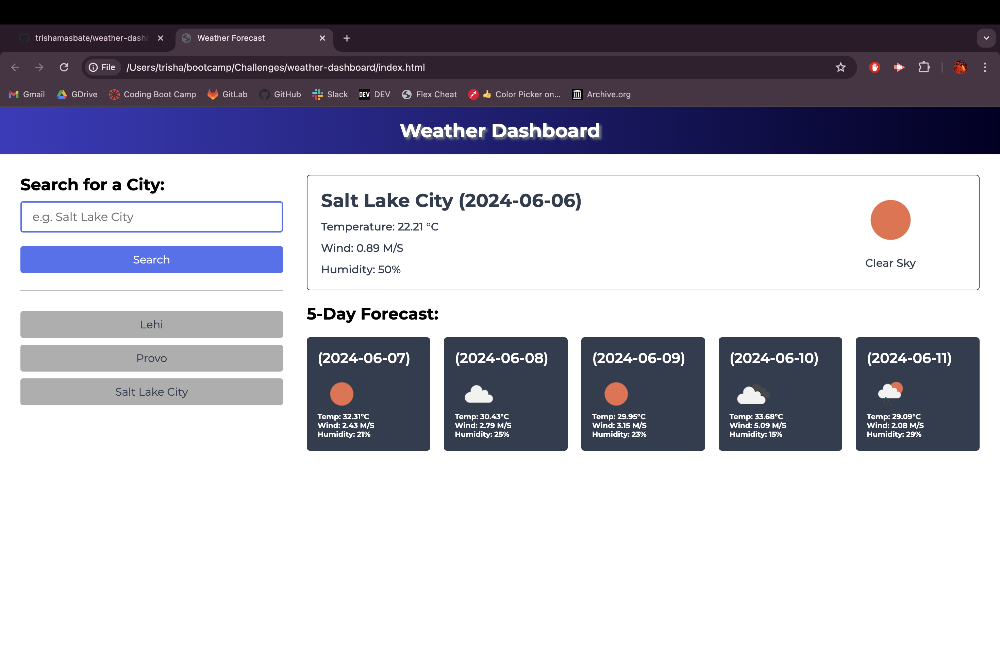

# 🌦️ Weather Forecast Dashboard

## ✏️ Description

This Weather Forecast Dashboard is designed to easily check the weather forecasts today and for the next few days for multiple cities, empowering you to plan your trips with confidence. From sunny skies to stormy days, stay ahead of the elements and tailor your adventures to the weather conditions ahead.

It is tailored to meet the following criteria:

- **Searchable City Input Form:** The weather dashboard should have form inputs for searching cities.
- **Current Weather Display:** Upon searching for a city, the dashboard should display current and future weather conditions for that city. Current weather conditions should include the city name, date, weather icon, temperature, wind speed, and humidity.
- **Future Weather Forecast:** Future weather conditions should display a 5-day forecast.
- **Search History Functionality:** The searched city should be added to the search history. Clicking on a city in the search history should display both current and future weather conditions for that city.


## ✏️ Installation and Usage

**💭 Type in the name of the city, and click on the "Search" button to start!**

To run the Weather Forecast Dashboard, you can do either of the following:

* Use the link:
  
  [Weather Dashboard](https://trishamasbate.github.io/weather-dashboard/)

* Clone the repository:
```
git clone git@github.com:trishamasbate/weather-dashboard.git
```

Below is a preview showing the functionality of the Weather Forecast Dashboard:




## ✏️ Credits

Credits to the following:

- Classmates
- TA and Instructors
- [Stack Overflow](https://stackoverflow.com/?newreg=f63e9ea2d90e48e6b29cd0118dd59f99)
- [MDN Web Docs](https://developer.mozilla.org/en-US/)
- [OpenWeather API](https://home.openweathermap.org/)

## ✏️ License

This project is licensed under the [MIT License](https://opensource.org/licenses/MIT).


## ✏️ Contributing

If you have any ideas, suggestions, or bug reports, please feel free to open an issue or submit a pull request. Thank you so much! 💕